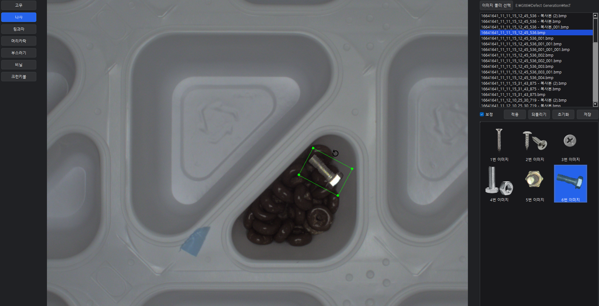
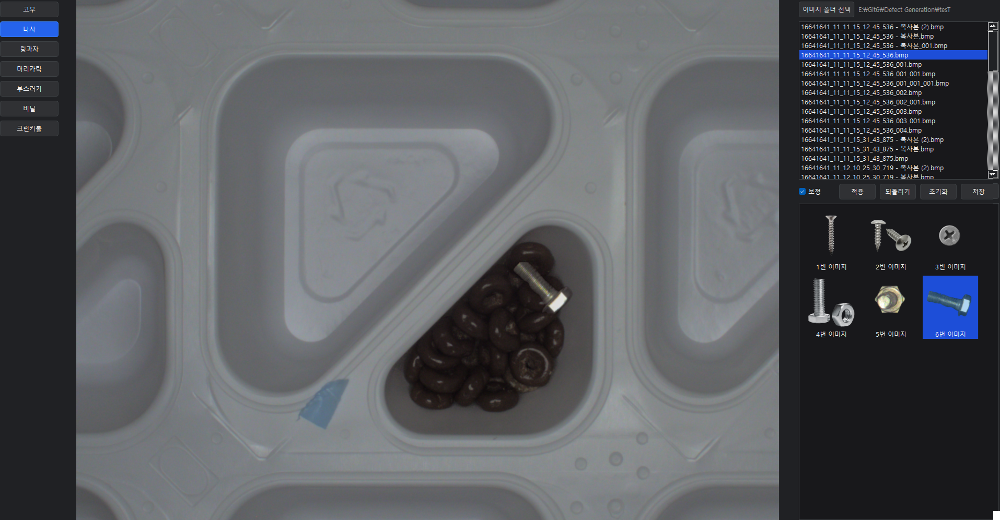

## Defect Generation (AI 학습용 결함 합성 툴)

PySide6 + OpenCV 기반의 **수동 이물 합성 도구**입니다.  
사용자가 `Object_list` 안의 이물 이미지를 직접 드래그해서 본 이미지 위에 올려놓고,
**위치 / 크기 / 회전 / 보정**을 조절한 뒤 적용·저장할 수 있습니다.

---

### 설치

1. **Python 3.10 이상** 설치
2. 이 디렉터리에서 다음 명령 실행:

```bash
pip install -r requirements.txt
```

> `requirements.txt` 에는 `PySide6`, `opencv-python`, `numpy` 가 포함되어 있습니다.

---

### 실행

```bash
python app.py
```

Windows 환경에서 한글 경로/파일명도 지원합니다.

---

### 기본 개념

- **원본 이미지**: 불량을 합성할 기본 이미지 (제품 트레이 등)
- **이물(Object)**: `Object_list` 폴더 안에 있는 개별 이물 이미지(나사, 비닐, 머리카락 등)
- **오버레이(Overlay)**: 실제 적용 전에, 화면 위에서 위치/크기/회전을 미리 조절하는 임시 상태

---

### UI 구성

- **좌측 패널**  
  - 이물 **카테고리 버튼들** (`고무`, `나사`, `핀그라`, `머리카락`, `부스러기`, `비닐`, `크린캡` 등)  
  - 선택된 카테고리는 버튼 색상/체크 상태로 유지

- **중앙 영역**  
  - 선택된 이미지를 표시하는 **메인 뷰어(ImageViewer)**  
  - 이물 썸네일을 드래그해서 떨어뜨리면, 해당 위치에 **초록색 박스 + 회전 아이콘**이 있는 오버레이가 생성됨

- **우측 패널**
  - 상단: **이미지 폴더 선택 버튼** + 현재 폴더 경로 표시
  - 그 아래: 폴더 내 이미지 파일 리스트 (현재 선택된 이미지는 항상 강조 표시)
  - 중단: `보정` 체크박스 + `적용 / 되돌리기 / 초기화 / 저장` 버튼
  - 하단: 현재 선택된 이물 카테고리의 **썸네일 리스트** (1번 이미지, 2번 이미지 …)

---

### UI 시각화

> 아래 이미지는 예시이며, 실제 파일명/경로는 사용 환경에 맞게 변경해 주세요.  
> 예: `docs/manual_overlay.png`, `docs/manual_applied.png` 로 저장 후 경로만 맞추면 됩니다.

- **크기/각도 조절 중인 화면**

docs/manual_overlay.png
// README 예시용: 이 위치에 첫 번째 스크린샷 파일을 두고,
// GitHub 등에서 이미지를 미리보기로 확인할 수 있습니다.
```

- **적용 완료된 화면**

docs/manual_applied.png
// README 예시용: 이 위치에 두 번째 스크린샷 파일을 두고,
// 합성 결과 이미지를 확인할 수 있습니다.
```

> 이미지 파일을 실제로 추가할 때는 위 코드 블록 대신 아래와 같이 일반 마크다운 문법을 쓰면 됩니다.
>
> ```markdown
> 
> 
> ```

---

### 사용 방법 (수동 이물 합성)

1. **이미지 폴더 선택**
   - 우측 상단의 `이미지 폴더 선택` 버튼 클릭 → 원본 이미지들이 있는 폴더 선택
   - 선택한 폴더의 이미지들이 리스트에 표시되고, 항목을 클릭하면 중앙 뷰어에 로딩됩니다.

2. **이물 카테고리 선택**
   - 좌측 카테고리 버튼 중 하나를 클릭 (`나사`, `비닐` 등)
   - 우측 하단 썸네일 리스트에 해당 카테고리의 이물 이미지들이 `1번 이미지`, `2번 이미지` 형태로 표시됩니다.

3. **이물 드래그 & 드롭**
   - 우측 썸네일 리스트에서 원하는 이물을 **마우스로 잡고 중앙 이미지로 드래그** → 놓기
   - 놓은 위치에 초록색 박스와 함께 이물이 오버레이로 표시됩니다.

4. **위치 / 크기 / 회전 조절**
   - **이물 이동**: 초록색 박스 내부를 드래그 → 위치 이동
   - **크기 조절**: 초록색 박스의 네 모서리(초록 핸들)를 드래그 → 폭/높이 변경  
     (회전된 상태에서도, 화면에 보이는 모서리를 직접 잡으면 됩니다)
   - **회전**: 박스 위쪽에 있는 **회전 아이콘(원형 화살표)** 을 드래그 → 실시간으로 각도 조절

5. **보정 옵션**
   - `보정` 체크박스 ON: 이물과 배경의 색/밝기, 테두리 블러 등을 적용하여 **더 자연스럽게 합성**
   - OFF: 원본 이물의 색/알파를 그대로 사용 (보정 없음)

6. **적용 / 되돌리기 / 초기화 / 저장**
   - **적용**: 현재 오버레이 상태(위치/크기/각도, 보정 옵션)를 실제 이미지에 합성하고,
     오버레이를 제거합니다.
   - **되돌리기**: 아직 적용하지 않은 현재 오버레이만 제거 (이미지 내용은 그대로).
   - **초기화**: 현재 이미지를 **원본 상태로 되돌림** (지금까지 합성한 이물도 모두 제거).
   - **저장**: 합성이 완료된 이미지를 **원본 파일명 + 번호** 형식으로 같은 폴더에 자동 저장  
     (예: `image.bmp` → `image_001.bmp`, `image_002.bmp` …). 저장 후 우측 리스트에도 추가되며,
     방금 저장한 이미지가 자동 선택됩니다.

7. **다른 이미지로 전환 시 저장 여부 확인**
   - 현재 이미지에 수정 사항이 있고(`dirty` 상태), 다른 이미지를 선택하면
     “저장할까요?” 메시지가 뜨며, **저장 / 저장 안 함 / 취소** 를 선택할 수 있습니다.

---

### Object_list 구조

- 프로젝트 루트에 `Object_list` 폴더를 두고, 그 안에 이물 카테고리별 하위 폴더를 만듭니다.
  - 예)  
    - `Object_list/나사`  
    - `Object_list/비닐`  
    - `Object_list/머리카락`  
- 각 폴더 안의 이미지들이 자동으로 읽혀서 좌측 카테고리 버튼 + 우측 썸네일 리스트에 반영됩니다.

---

### 참고 / 확장 아이디어

- 현재는 수동 합성(UI 조작) 중심이지만, 코드 내부에는 **자동 이물 합성용 로직**도 일부 포함되어 있어
  향후 자동 모드 UI를 다시 붙여서 사용할 수 있습니다.
- 추후 계획
  - 특정 라벨 포맷(COCO, YOLO 등)으로 Ground Truth 자동 저장
  - 다양한 보정 파라미터(블러 강도, 색상 매칭 강도 등)를 슬라이더로 조절
  - 여러 이미지를 대상으로 배치 합성/저장하는 자동 모드 재구현

